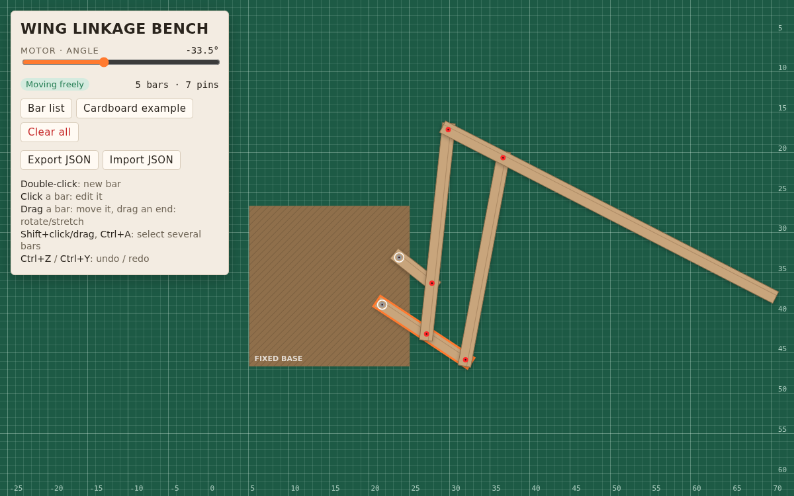
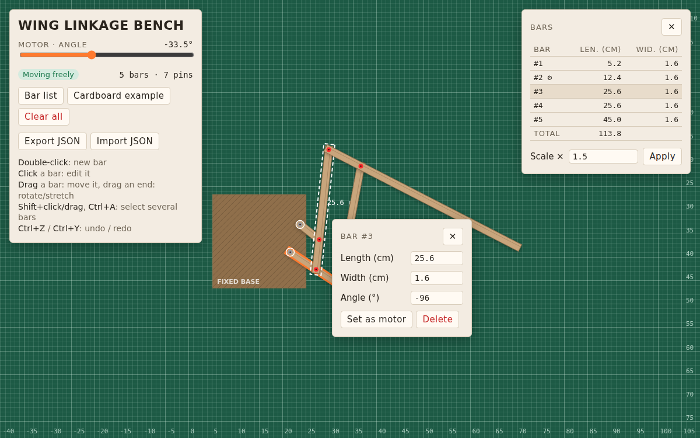
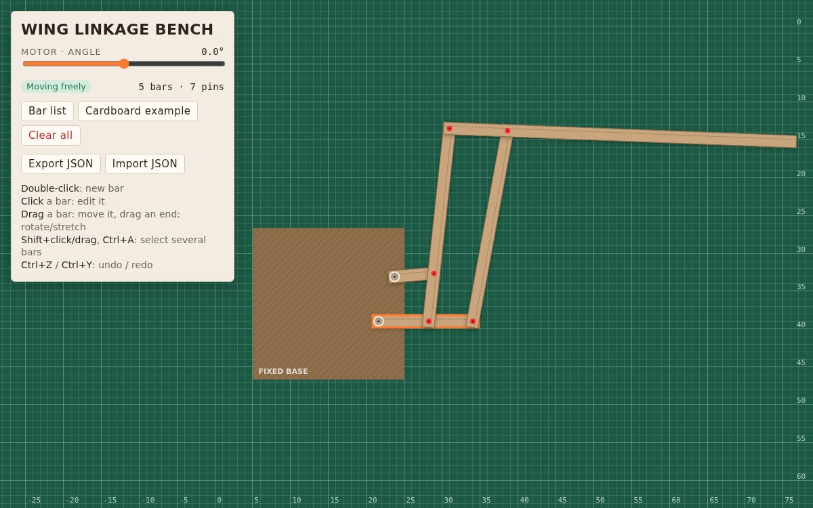
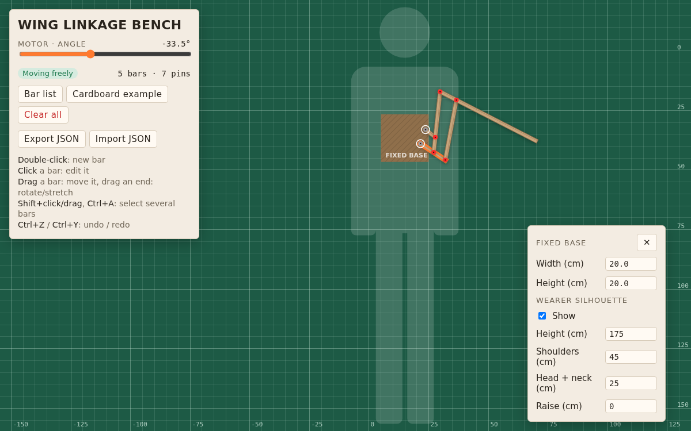

# Wing Linkage Bench

A small browser tool to design and test the linkage of a moving wing. It simulates how the whole wing moves and where it gets stuck, and shows it at scale on the wearer's back.

## How to use it

1. **Open** `index.html` in a browser. The cardboard prototype loads as an example.
2. **Add a bar**: double-click on an empty spot.
3. **Move a bar**: drag it. Drag one of its ends to rotate or stretch it.
4. **Connect bars**: make two bars touch — a red pin appears.
5. **Fix to the base**: a bar touching the brown square gets a free pin (white ring). Click it and choose **Attach to base**: the pin turns grey and holds the bar.
6. **Edit a bar**: click it to set its length, width and angle, delete it, or make it the motor (the motor needs a pin attached to the base).

7. **Run the motor**: move the slider. The status shows *Moving freely*, or *Jammed* when the wing gets stuck.

## Wearer silhouette

Click the brown base and tick **Show** to display a semi-transparent silhouette of the person wearing the wing, seen from the back, with the base centered on the upper back. It helps check the wing's size against a real body.

- **Height**: total height of the person.
- **Shoulders**: real width across the shoulders.
- **Head + neck**: from the top of the skull to the base of the neck; the rest of the body adapts.
- **Raise**: moves the silhouette relative to the base (positive values move it down).

The same menu sets the base's width and height.

## Shortcuts

- **Shift+click** / **Ctrl+click** a bar, **Shift+drag** a box, or **Ctrl+A**: select several bars, then drag one to move them all.
- **Delete**: remove the selected bars. **Esc**: clear the selection.
- **Ctrl+Z** / **Ctrl+Y** (or Ctrl+Shift+Z): undo / redo.
- **Mouse wheel**: zoom. **Drag the background**: pan.

## Other buttons

- **Bar list**: all bars with their length and width, the total length of cardboard needed, and a scale factor to resize the whole wing.
- **Cardboard example**: reload the example prototype.
- **Export / Import JSON**: save a design to a file and load it back later.
- **Clear all**: start from scratch (click twice to confirm).

Your work is saved automatically in the browser (localStorage).
