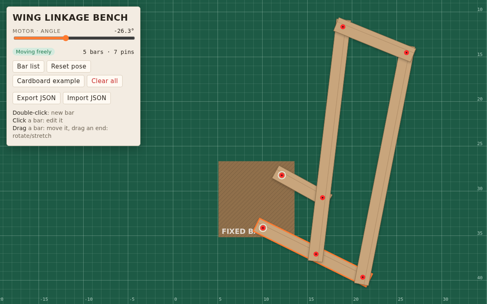
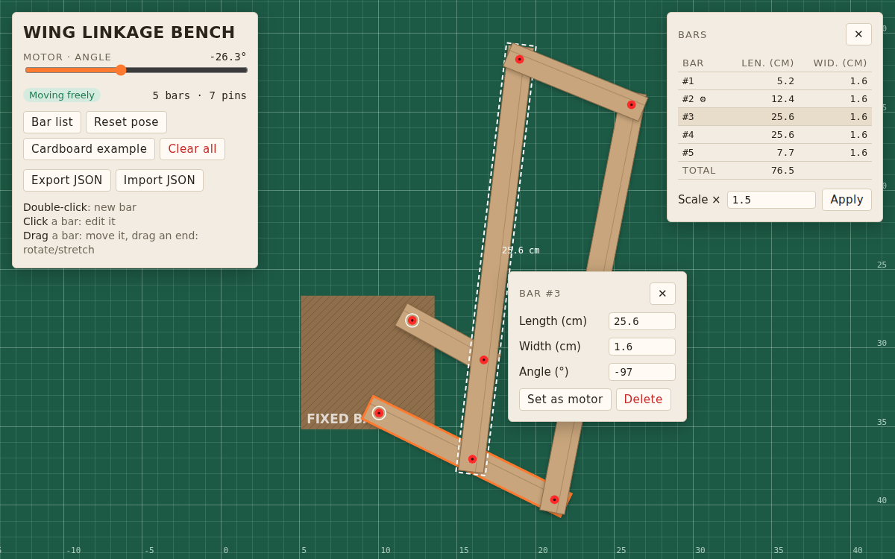
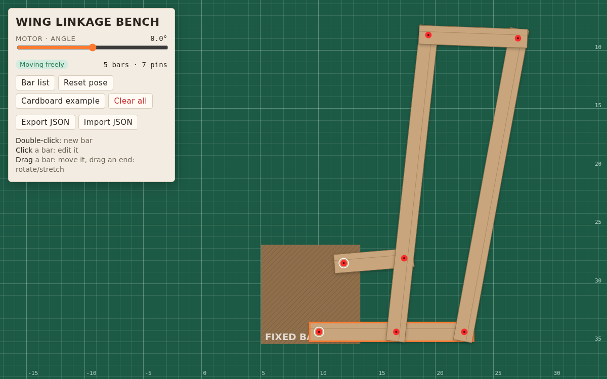

# Wing Linkage Bench

A small browser tool to design and test linkage of a moving wing. It simulates how the whole wing moves and where it gets stuck.

## How to use it

1. **Open** `wing-bench.html` in a browser. The cardboard prototype loads as an example.
2. **Add a bar**: double-click on an empty spot.
3. **Move a bar**: drag it. Drag one of its ends to rotate or stretch it.
4. **Connect bars**: make two bars touch — a red pin appears. A bar touching the brown square is pinned to the fixed base.
5. **Edit a bar**: click it to set its length, width and angle, delete it, or make it the motor (the motor must be pinned to the base).

6. **Run the motor**: move the slider. The status shows *Moving freely* when the wing moves freely, or *Jammed* when it jams.

## Other buttons

- **Bar list**: all bars with their length and width, the total length of cardboard needed, and a scale factor to resize the whole wing.
- **Reset pose**: go back to the position before the motor moved.
- **Export / Import JSON**: save a design to a file and load it back later.
- **Clear all**: start from scratch (click twice to confirm).

Your work is saved automatically in the browser (localStorage)